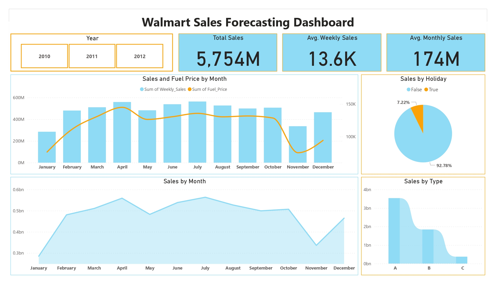

# Walmart Sales Forecasting Analysis

## Overview
- **This project analyzes the Walmart Sales Forecast dataset (Feb 2010-Nov 2012) from [Kaggle](https://www.kaggle.com/datasets/aslanahmedov/walmart-sales-forecast), cleaned and aggregated into monthly sales using Python (`pandas`, `matplotlib`, `statsmodels`, `kagglehub`). It features visualizations (Line and Clustered Column, Stacked Area, Pie, Scatter, Stacked Bar) and an interactive Power BI dashboard with DAX measures and slicers for insights into sales trends, store types, and economic factors.

## Dashboard Screenshot


## Requirements
- **Installation**: Install Python packages with:
  ```bash
  pip install -r requirements.txt
  ```
- **Dependencies**:
  - `pandas==2.2.2`
  - `matplotlib==3.9.2`
  - `kagglehub==0.2.5`
  - `statsmodels==0.14.2`

## Files and Data
- **walmart_data.parquet**: Compressed cleaned dataset with sales, store, and feature data.
- **monthly_sales.csv**: Aggregated monthly sales data.
- **visualizations/**: Directory containing PNGs of generated plots (e.g., seasonal decomposition).
- **Walmart_Sales_Dashboard.pbix**: Power BI dashboard file.

## Instructions
### Decompress Parquet and Convert to CSV
- **Step 1: Install Libraries**
  - Ensure `pandas` is installed: `pip install pandas`.
- **Step 2: Run Conversion Script**
  - Execute the following Python code:
    ```python
    import pandas as pd
    # Load Parquet file
    df = pd.read_parquet('cleaned_data.parquet')
    # Save as CSV
    df.to_csv('cleaned_data.csv', index=False)
    print("Conversion complete. File saved as cleaned_data.csv.")
    ```
- **Step 3: Verify Output**
  - Check the generated `cleaned_data.csv` for accuracy.

### Usage
- **Visualizations**: Run Python scripts to regenerate plots.
- **Dashboard**: Open `TimeSaries.pbix` in Power BI Desktop for interactive analysis.
- **Data Updates**: Modify scripts to refresh or add new aggregations.
